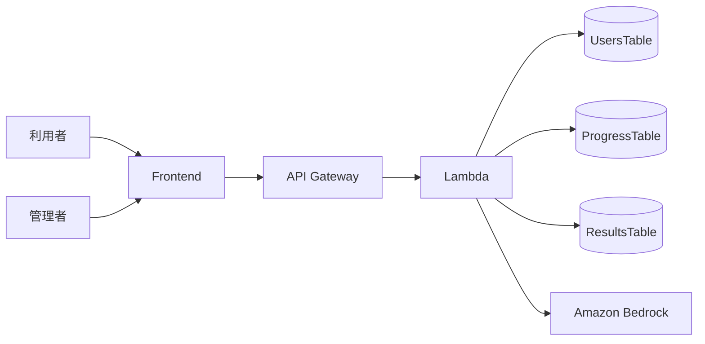
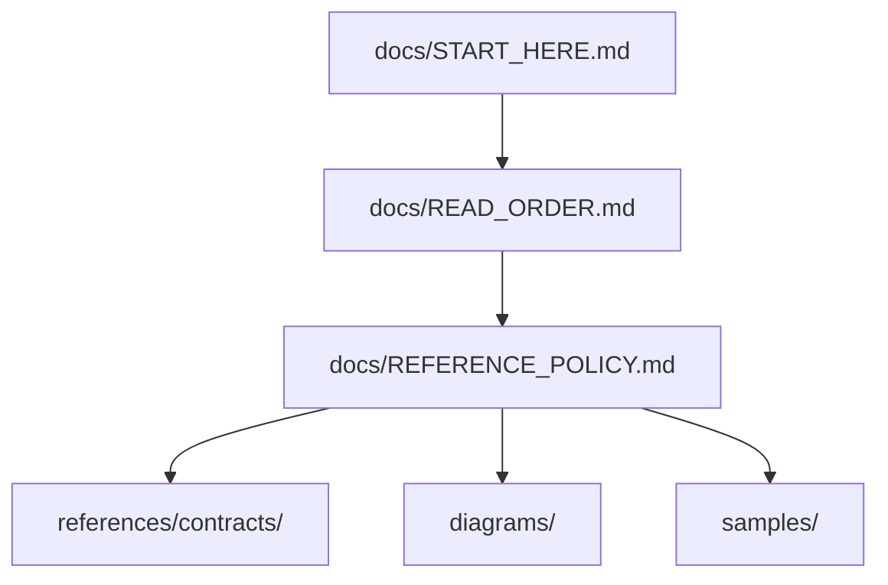

# Devin 参照ドキュメント

このページは、`Devin-reference-repo` を GitHub Pages で閲覧するための入口です。

> このサイトは参考用です。ここにある stub、sample、Mermaid 図は正本ではありません。

## まず読むもの

1. [開始ガイド](./START_HERE.html)
2. [読込順](./READ_ORDER.html)
3. [参照ポリシー](./REFERENCE_POLICY.html)
4. [アップロード定義](../devin-upload-definition.html)

## このサイトで見られるもの

- Devin に渡す handoff の考え方
- 参考用の contract stub
- 画面、API、データ、deploy の観点
- Mermaid による構成図、画面遷移図、deploy フロー図

## Mermaid 図

### システム構成

### 画面と参照情報の関係

## おすすめの使い方

- handoff 設計前に観点漏れチェックとして使う
- Devin / Codex に渡すファイル構成の参考にする
- 新人向けに「何を定義してから実装に入るべきか」を説明する

この repo は、実案件の deploy 用 repo ではありません。実装を進めるときは、別途 authoritative な contract 群を作成してください。

